<h1 align="center">👋 Hi there, I'm Jeshan Rai!</h1>

  

  Full-stack developer building <b>scalable web and mobile applications</b>

---

## 🧰 When I code, I rely on

**Languages**

**Frontend & Mobile**

**Backend & APIs**

**Databases & ORMs**

**DevOps & Infrastructure**

**Cloud & Hosting**

**Queues, Storage & Payments**

**AI & LLMs**

**Testing, Tooling & Monitoring**

---

## 📊 My GitHub contributions summary

  

  

  

<!--
  Optional sections — uncomment and fill in when you're ready:

  ## ✍️ My most recent articles
  - [Post title](https://example.com/post)

  ## 🤝 Connect with me
  
  

  ## ☕ Support
  
-->
